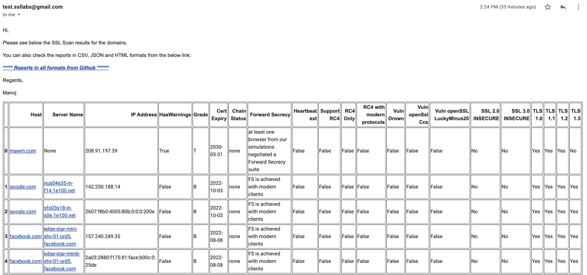

This Tool generate the reports for a list of domain/hosts names and stores them in JSON/HTML/CSV Format. It uses Qualys SSL Labs API which is available at (https://github.com/ssllabs/ssllabs-scan/blob/stable/ssllabs-api-docs.md)

The generated report is sent to the desired emails which is mandatory argument for the tool. 

## Sample Reports
Please see the sample reports at: https://github.com/testSSLLabs/SSLScanResults/tree/main/sslscanresults/Reports

## Sample Emails:


## Create virtual environment:
```
pip3 install virtualenv
mkdir project_A
cd project_A
virtualenv my_new_venv
source my_new_venv/bin/activate
```

## Clone the project repo and install dependency packages from requirements.txt :
```
git clone https://github.com/testSSLLabs/SSLScanResults.git
pip3 install -r SSLScanResults/requirements.txt
```

## Execute the script:
By default tool get its domain names host list by cloning Github Repo [https://github.com/testSSLLabs/SSLScanResults.git ](https://github.com/testSSLLabs/SSLLab_hosts_and_report). It retreives the domain names from the domain_names.yaml located in this repo. 
Also, all the generated CSV/JSON/HTML reports are copied to Reports directory in the Repo and pushed the new changes to Master branch. 
#### However, Tool must be executed in this manner ONLY with docker instance as Docker handles copying the private/public RSA keys required to push the new reports. 


### Local mode
- **NOTE**: Please execute the tool in Local Mode if you just want to get the emails with SSL reports of your domain names. In local mode
            hosts are parsed from  **SSLScanResults/sslscanresults/domain_names.yaml** which you can locally edit to get desired hosts. 
            Reports are saved locally in **SSLScanResults/sslscanresults/Reports** directory
- **--re (receiver email) is mandatory argument to email reports to desired receipients.**
``` 
python3 SSLScanResults/sslscanresults/sslscan-results.py --local --re test_your_email_adress@gmail.com
```


2. You can also specify the domain names with your own local domain_names.yaml file
``` 
python3 SSLScanResults/sslscanresults/sslscan-results.py --local --re test_your_email_adress@gmail.com --domain_yaml /tmp/manjku/domain_names.yaml
``` 

## Execute tool in a docker instance
``` 
git clone https://github.com/testSSLLabs/SSLScanResults.git
cd SSLScanResults
docker build -t ssllab_report:20.0 .
``` 

### Get the docker image ID:
``` 
docker images ssllab_report:20.0
``` 

### Create docker containre to execute the tool. Please use the --re option to specify the email to which reports must be sent.
``` 
docker run 00528c8085e4 python3 /project/SSLScanResults/sslscanresults/sslscan-results.py --re test_your_email_adress@gmail.com
``` 
### If domains/hosts list need to be updated(addition/deletion) then you must GIT push the changes in https://github.com/testSSLLabs/SSLLab_hosts_and_report/blob/main/domain_names.yaml
